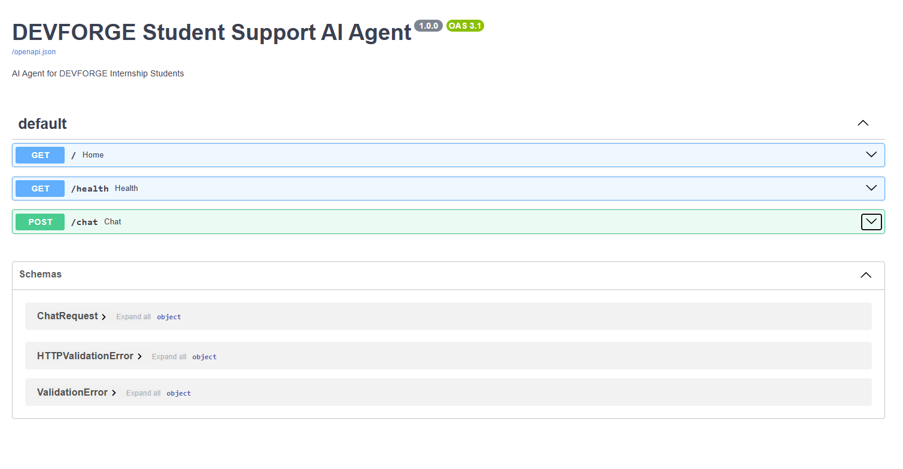
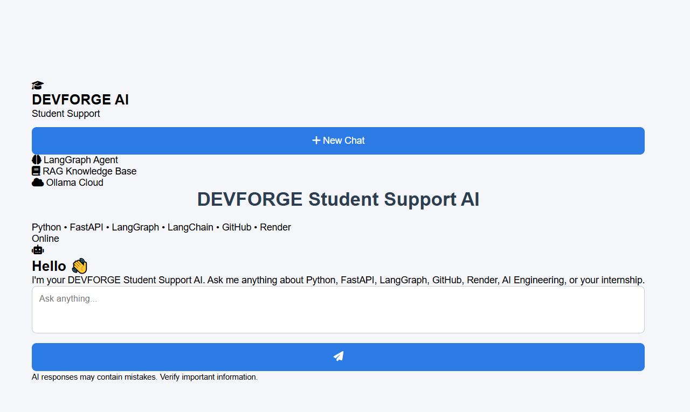
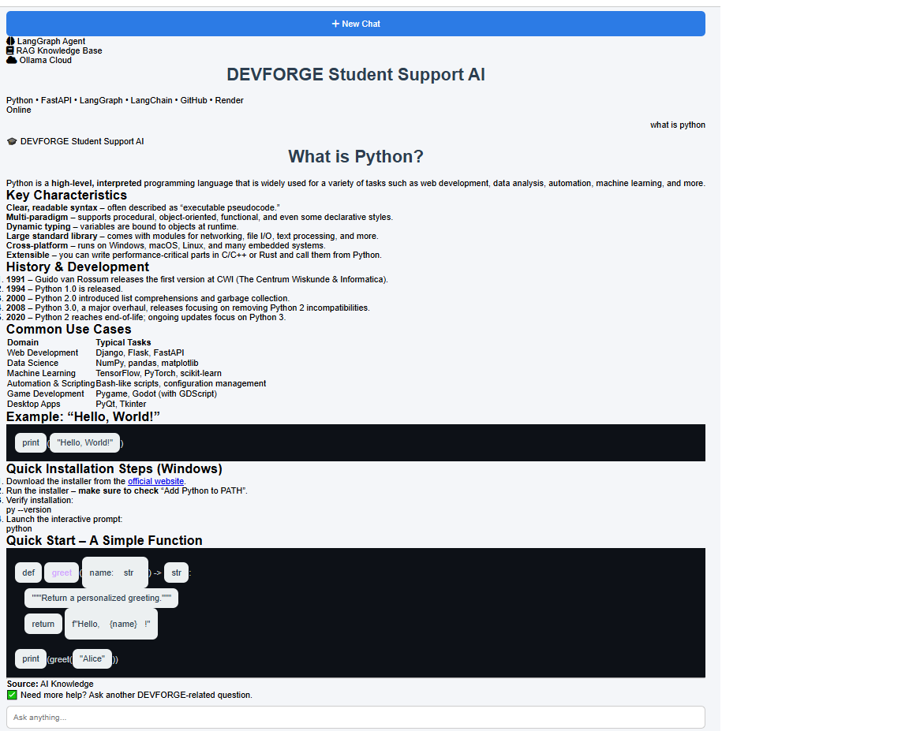
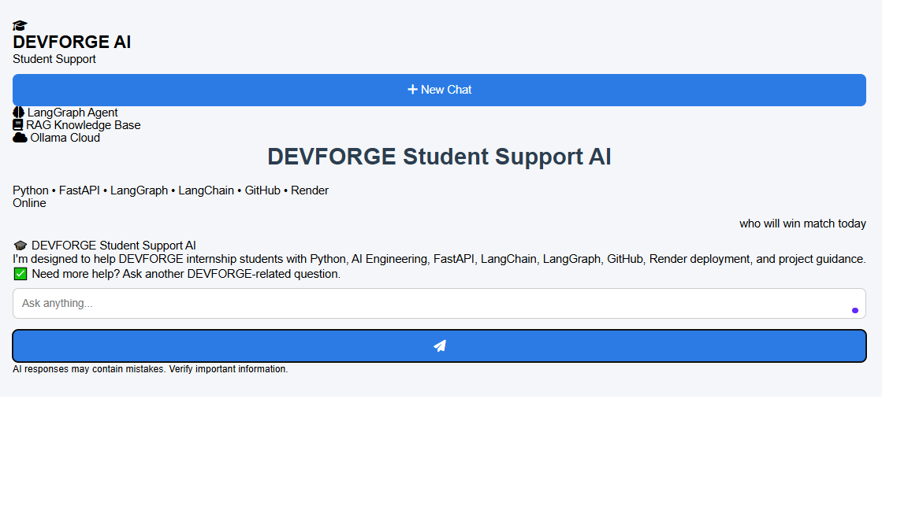

# 🎓 DEVFORGE Student Support AI Agent

A professional AI-powered student support assistant built using **FastAPI**, **LangGraph**, and **Ollama Cloud** to help DEVFORGE internship students with AI Engineering and technical learning.

---

# Features

- AI-powered student support
- LangGraph workflow
- Question classification
- Safe response system
- Conversation memory
- FAQ node
- Response formatting
- Basic Retrieval-Augmented Generation (RAG)
- Ollama Cloud integration
- FastAPI REST API
- Professional web interface
- Swagger API documentation

---

# Tech Stack

| Technology | Purpose |
|------------|---------|
| Python | Backend |
| FastAPI | REST API |
| LangGraph | AI Workflow |
| LangChain | AI Orchestration |
| Ollama Cloud | Large Language Model |
| HTML/CSS/JavaScript | Frontend |
| GitHub | Version Control |
| Render | Deployment |

---

# Project Structure

```
devforge-student-support-ai/
│
├── knowledge/
│   ├── faq.txt
│   ├── fastapi.txt
│   ├── github.txt
│   └── render.txt
│
├── screenshots/
│   ├── dashboard.png
│   ├── response.png
│   └── response2.png
│
├── static/
│   ├── index.html
│   ├── style.css
│   └── script.js
│
├── agent.py
├── rag.py
├── faq.py
├── main.py
├── render.yaml
├── requirements.txt
├── .env.example
├── README.md
└── .gitignore
```

---

# LangGraph Workflow

```
                User Question
                      │
                      ▼
           Question Classification
              │               │
              │               │
              ▼               ▼
        AI Support Node   Safe Response
              │
              ▼
        Response Formatter
              │
              ▼
         Final AI Response
```

---

# API Endpoints

| Method | Endpoint | Description |
|---------|----------|-------------|
| GET | / | Welcome Message |
| GET | /health | Health Check |
| POST | /chat | AI Chat Endpoint |
| GET | /docs | Swagger Documentation |

---

## API Documentation



# Installation

Clone the repository

```bash
git clone https://github.com/YOUR_USERNAME/devforge-student-support-ai.git
```

Move into the project

```bash
cd devforge-student-support-ai
```

Create virtual environment

```bash
python -m venv .venv
```

Activate environment

Windows

```bash
.venv\Scripts\activate
```

Install dependencies

```bash
pip install -r requirements.txt
```

Create a `.env`

```env
OLLAMAAPIKEY=YOUR_API_KEY
OLLAMA_MODEL=gpt-oss:20b-cloud
```

Run the application

```bash
uvicorn main:app --reload
```

---

# Screenshots

## Dashboard



---

## Related Question



---

## Unrelated Question



---

# Example Request

```json
POST /chat

{
  "message": "How do I deploy my project on Render?"
}
```

---

# Example Response

```json
{
    "response": "Follow these steps to deploy your FastAPI project on Render..."
}
```

---

# Security

- API key stored using environment variables
- `.env` excluded from GitHub
- `.env.example` included for setup
- No sensitive credentials committed

---

# Bonus Features

- Conversation Memory
- FAQ Node
- Response Formatter
- Basic RAG
- Professional Frontend
- Error Handling
- Ollama Cloud Integration

---

# Future Improvements

- Vector Database
- Semantic Search
- PDF Knowledge Base
- Authentication
- Chat History Database
- Streaming Responses
- Voice Support

---

# Deployment

Backend deployed on Render.

Render Start Command

```bash
uvicorn main:app --host 0.0.0.0 --port $PORT
```

---

# Author

**Ayesha Imran**

Bachelor of Artificial Intelligence

University of Faisalabad

---

# License

This project is developed for the **DEVFORGE Internship Program** for educational purposes.